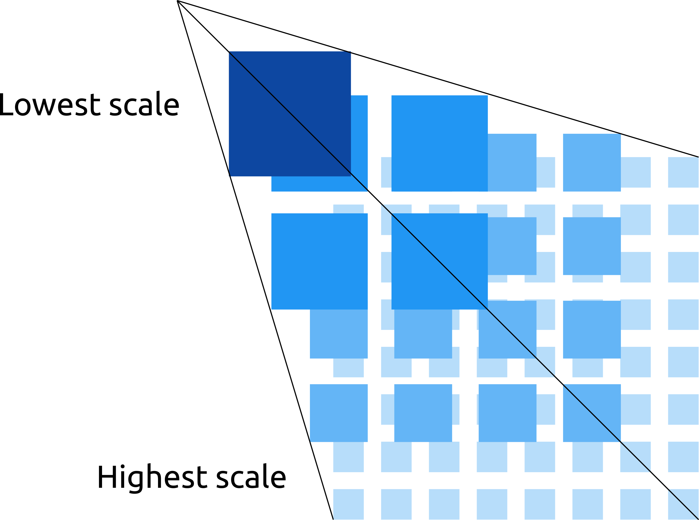
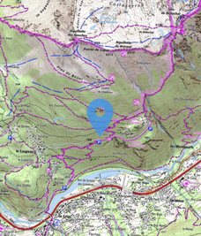
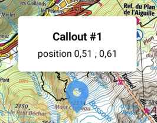
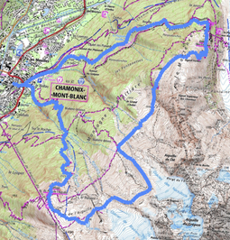

[](https://mvnrepository.com/artifact/ovh.plrapps/mapcompose)
[](http://www.apache.org/licenses/LICENSE-2.0)
[](https://developer.android.com/jetpack/compose/bom/bom)

🎉 News:
- Proper support of `setScrollOffsetRatio` api, along with performance improvements.
- New gestures added (zoom fling, double tap to zoom, two fingers tap)
- Marker clustering and lazy-loading. New examples added to the demo app

# MapCompose

MapCompose is a fast, memory efficient Jetpack compose library to display tiled maps with minimal effort.
It shows the visible part of a tiled map with support of markers and paths, and various gestures
(flinging, dragging, scaling, and rotating).

An example of setting up:

```kotlin
/* Inside your view-model */
val tileStreamProvider = TileStreamProvider { row, col, zoomLvl ->
    FileInputStream(File("path/{$zoomLvl}/{$row}/{$col}.jpg")) // or it can be a remote HTTP fetch
}

val state: MapState by mutableStateOf(
    MapState(4, 4096, 4096).apply {
        addLayer(tileStreamProvider)
        enableRotation()
    }
)

/* Inside a composable */
@Composable
fun MapContainer(
    modifier: Modifier = Modifier, viewModel: YourViewModel
) {
    MapUI(modifier, state = viewModel.state)
}
```

Inspired by [MapView](https://github.com/p-lr/MapView), every aspects of the library have
been revisited. MapCompose brings the same level of performance as MapView, with a simplified API.

This project holds the source code of this library, plus a demo app - which is useful to get started.
To test the demo, just clone the repo and launch the demo app from Android Studio.

## Installation

Add this to your module's build.gradle
```groovy
implementation 'ovh.plrapps:mapcompose:2.4.1'
```

Starting with v.2.4.1, the library is using the 
[compose BOM](https://developer.android.com/jetpack/compose/bom/bom). The version of the BOM is
specified in the release notes. The demo app shows an example of how to use it.

## Basics

MapCompose is optimized to display maps that have several levels, like this:

<p align="center">

</p>

Each next level is twice bigger than the former, and provides more details. Overall, this looks like
 a pyramid. Another common name is "deep-zoom" map.
This library comes with a demo app featuring various use-cases such as using markers, paths,
map rotation, etc. All examples use the same map stored in the assets, which is a great example of
deep-zoom map.

MapCompose can also be used with single level maps.

### Usage

With Jetpack Compose, we have to change the way we think about views. In the previous `View`
system, we had references on views and mutated their state directly. While that could be done right,
the state often ended-up scattered between views own state and application state. Sometimes, it was
difficult to predict how views were rendered because there were so many things to take into account.

Now, the rendering is function of a state. If that state changes, the "view" updates accordingly.
The library exposes its API though `MapState`, which is the _only_ public handle to mutate the state
of the "view" (or in Compose terms, "composables"). As its name suggests, `MapState` also _owns_ the
state. Therefore, composables will always render consistently - even after a device rotation.

In a typical application, you create a `MapState` instance inside a `ViewModel` (or whatever
component which survives device rotation). Your `MapState` should then be passed to the `MapUI`
composable. The code sample at the top of this readme shows an example. Then, whenever you need to
update the map (add a marker, a path, change the scale, etc.), you invoke APIs on your `MapState`
instance. All public APIs are located under the
[api](mapcompose/src/main/java/ovh/plrapps/mapcompose/api) package. The following sections provide
details on the `MapState` class, and give examples of how to add markers, callouts, and paths.

### MapState

The `MapState` class expects three parameters for its construction:
* `levelCount`: The number of levels of the map,
* `fullWidth`: The width of the map at scale 1.0, which is the width of last level,
* `fullHeight`: The height of the map at scale 1.0, which is the height of last level

### Layers

MapCompose supports layers though the ability to add several tile pyramids. Each level is made of
the superposition of tiles from all pyramids at the given level. For example, at the second level
(starting from the lowest scale), tiles would look like the image below when three layers are added.

<p align="center">

</p>

Your implementation of the `TileStreamProvider` interface (see below) is what defines a tile
pyramid. It provides `InputStream`s of image files (png, jpg). MapCompose will request tiles using
the convention that the origin is at the top-left corner. For example, the tile requested with
`row` = 0, and `col = 0` will be positioned at the top-left corner.

```kotlin
fun interface TileStreamProvider {
    suspend fun getTileStream(row: Int, col: Int, zoomLvl: Int): InputStream?
}
```

Depending on your configuration, your `TileStreamProvider` implementation might fetch local files,
as well as performing remote HTTP requests - it's up to you. You don't have to worry about threading,
MapCompose takes care of that (the main thread isn't blocked by `getTileStream` calls). However, in
case of HTTP requests, it's advised to create a `MapState` with a higher than default `workerCount`.
That optional parameter defines the size of the dedicated thread pool for fetching tiles, and defaults
to the number of cores minus one. Typically, you would want to set `workerCount` to 16 when performing
HTTP requests. Otherwise, you can safely leave it to its default.

To add a layer, use the `addLayer` on your `MapState` instance. There are others APIs for reordering,
removing, setting alpha - all dynamically.

### Markers

To add a marker, use the [addMarker](https://github.com/p-lr/MapCompose/blob/982caf29ab5e86b58c56812735f60bfe405638ea/mapcompose/src/main/java/ovh/plrapps/mapcompose/api/MarkerApi.kt#L30)
API, like so:

```kotlin
/* Add a marker at the center of the map */
mapState.addMarker("id", x = 0.5, y = 0.5) {
    Icon(
        painter = painterResource(id = R.drawable.map_marker),
        contentDescription = null,
        modifier = Modifier.size(50.dp),
        tint = Color(0xCC2196F3)
    )
}
```

<p align="center">

</p>

A marker is a composable that you supply (in the example above, it's an `Icon`). It can be
whatever composable you like. A marker does not scale, but it's position updates as the map scales,
so it's always attached to the original position. A marker has an anchor point defined - the point
which is fixed relatively to the map. This anchor point is defined using relative offsets, which are
applied to the width and height of the marker. For example, to have a marker centered horizontally 
and aligned at the bottom edge (like a typical map pin would do), you'd pass -0.5f and -1.0f as
relative offsets (left position is offset by half the width, and top is offset by the full height).
If necessary, an absolute offset expressed in pixels can be applied, in addition to the
relative offset.

Markers can be moved, removed, and be draggable. See the following APIs: [moveMarker](https://github.com/p-lr/MapCompose/blob/2fbf0967290ffe01d63a6c65a3022568ef48b9dd/mapcompose/src/main/java/ovh/plrapps/mapcompose/api/MarkerApi.kt#L72),
[removeMarker](https://github.com/p-lr/MapCompose/blob/2fbf0967290ffe01d63a6c65a3022568ef48b9dd/mapcompose/src/main/java/ovh/plrapps/mapcompose/api/MarkerApi.kt#L61),
[enableMarkerDrag](https://github.com/p-lr/MapCompose/blob/2fbf0967290ffe01d63a6c65a3022568ef48b9dd/mapcompose/src/main/java/ovh/plrapps/mapcompose/api/MarkerApi.kt#L89).

### Callouts

Callouts are typically message popups which are, like markers, attached to a specific position.
However, they automatically dismiss on touch down. This is default behavior can be changed. 
To add a callout, use [addCallout](https://github.com/p-lr/MapCompose/blob/2fbf0967290ffe01d63a6c65a3022568ef48b9dd/mapcompose/src/main/java/ovh/plrapps/mapcompose/api/MarkerApi.kt#L220).

<p align="center">

</p>

Callouts can be programmatically removed (if automatic dismiss was disabled).

### Paths

To add a path, follow these steps:

```kotlin
// 1. Get a PathDataBuilder
val builder: PathDataBuilder = mapState.makePathDataBuilder()

// 2. Build the path
for (point in points) {
    builder.addPoint(point.x, point.y)
}
val pathData = builder.build()

// 3. Use the API
mapState.addPath("pathName", pathData, color = Color(0xFF448AFF), width = 12.dp)
```

It's important to note that the only way to get a `PathDataBuilder` is by using the
`makePathDataBuilder` function. Once you've built your `PathData` instance, you can use
the [addPath](https://github.com/p-lr/MapCompose/blob/ac8ead5c7eb9f925e12565822e77b026a6c5fce0/mapcompose/src/main/java/ovh/plrapps/mapcompose/api/PathApi.kt#L10)
API.

<p align="center">

</p>

## State change listener

In order to get notified whenever the state (scale, scroll, rotation) changes, you can register a
callback using `setStateChangeListener` API:

```kotlin
mapState.setStateChangeListener {
   println("scale: $scale, scroll: $scroll, rotation: $rotation")
}
```

To unregister, use `removeStateChangeListener()`.

## Animate state change

It's pretty common to programmatically animate the scroll and/or the scale, or even the rotation of
the map.

*scroll and/or scale animation*

When animating the scale, we generally do so while maintaining the center of the screen at
a specific position. Likewise, when animating the scroll position, we can do so with or without 
animating the scale altogether, using [scrollTo](https://github.com/p-lr/MapCompose/blob/08c0f68f654c1ce27a295f3fb6c25e9cf4274de9/mapcompose/src/main/java/ovh/plrapps/mapcompose/api/LayoutApi.kt#L188)
and [snapScrollTo](https://github.com/p-lr/MapCompose/blob/08c0f68f654c1ce27a295f3fb6c25e9cf4274de9/mapcompose/src/main/java/ovh/plrapps/mapcompose/api/LayoutApi.kt#L161).

*rotation animation*

For animating the rotation while keeping the current scale and scroll, use the
[rotateTo](https://github.com/p-lr/MapCompose/blob/08c0f68f654c1ce27a295f3fb6c25e9cf4274de9/mapcompose/src/main/java/ovh/plrapps/mapcompose/api/LayoutApi.kt#L149) API.

Both `scrollTo` and `rotateTo` are suspending functions. Therefore, you know exactly when
an animation finishes, and you can easily chain animations inside a coroutine.

```kotlin
// Inside a ViewModel
viewModelScope.launch {
    mapState.scrollTo(0.8, 0.8, destScale = 2f)
    mapState.rotateTo(180f, TweenSpec(2000, easing = FastOutSlowInEasing))
}
```

For a detailed example, see the "AnimationDemo".

## Design changes and differences with MapView

* In MapView, you had to define bounds before you could add markers. There's no such concept
in MapCompose anymore. Now, coordinates are normalized. For example, (x=0.5, y=0.5) is a point located at
the center of the map. Normalized coordinates are easier to reason about, and application code can
still translate this coordinate system to a custom one.

* In MapView, you had to build a configuration and use that configuration to create a `MapView`
instance. There's no such thing in MapCompose. Now, you create a `MapState` object with required
parameters.

* A lot of things which couldn't change after MapView configuration can now be changed dynamically
in MapCompose. For example, the `zIndex` of a marker, or the minimum scale mode can be changed at
runtime.

## Difference with `1.x` version

* There's now a way to set initial values for various properties such as scroll, scale, etc using
the `InitialValuesBuilder` in the `MapState` constructor. To produce similar behavior in 1.x, one
had to launch a coroutine right after `MapState` creation - which wasn't perfect since some
undesired tile loading could happen between the initialization and the destination state.

* Having a `TileStreamProvider` at `MapState` construction is no longer mandatory.
`TileStreamProvider`s are now added using the `addLayer` api, which is completely dynamic.

* While 1.x version had a non-suspending `TileStreamProvider`, 2.x greatly benefits from the new
suspend version. If you're using a library like Retrofit to perform remote http fetch (and suspend
calls), tile loading will be optimal since all layers are fetched concurrently. That was already the
case in 1.x, but not thanks to suspending calls.

## Contributors

Marcin (@Nohus) has contributed and fixed some issues. He also thoroughly tested the new layers 
feature – which made `MapCompose` better.

