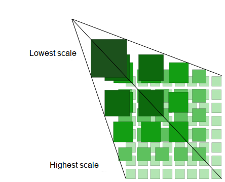

# MapCompose

MapCompose is a fast, memory efficient Jetpack compose library to display tiled maps with minimal effort.
It shows the visible part of a tiled map with support of markers and paths, and various gestures
(flinging, dragging, scaling, and rotating).

An example of setting up:

```kotlin
/* Inside your view-model */
val tileStreamProvider = object : TileStreamProvider {
     override suspend fun getTileStream(row: Int, col: Int, zoomLvl: Int): InputStream? {
         return FileInputStream(File("path/{zoomLvl}/{row}/{col}.jpg")) // or it can be a remote HTTP fetch
     }
}

val state: MapState by mutableStateOf(
    MapState(4, 4096, 4096, tileStreamProvider).apply {
        enableRotation()
        scrollToAndCenter(0.5, 0.5)
    }
)

/* Inside a composable */
@Composable
fun MapContainer(
    modifier: Modifier = Modifier, viewModel: YourViewModel
) {
    MapUI(modifier, state = viewModel.state)
}
```

Inspired from [MapView](https://github.com/peterLaurence/MapView), every aspects of the library have
been revisited. MapCompose brings the same level of performance as MapView, with a simplified API.

This project holds the source code of this library, plus a demo app (which is useful to get started).
To test the demo, just clone the repo and launch the demo app from Android Studio Canary (for now).

**🚧 Almost done 🚧**

The core library is done, and all features of MapView are now implemented in MapCompose. I'll continue
to add more demo for various scenario.

## Roadmap / TODO

* Core library
  * [x] Implement the equivalent of ZoomPanLayout in compose
  * [x] Implement a first minimal version (tiles loading only)
  * [x] Markers support
  * [x] Paths support
  * [x] Custom drawings support
  * [x] Callouts support

* Demo app
  * [x] Simple map view
  * [x] More advanced rotation APIs use
  * [x] Map with markers
  * [x] Center on marker with animation
  * [x] Map with paths
  * [x] Custom drawings
  * [x] Callouts demo

* Publication
  * [ ] Publish on maven central, under `ovh.plrapps.mapcompose`, artifact id `mapcompose`

## Basics

MapCompose is optimized to display maps that have several levels, like this:

<p align="center">

</p>

Each next level is twice bigger than the former, and provides more details. Overall, this looks like
 a pyramid. Another common name is "deep-zoom" map.
This library comes with a demo app made of a set of various use-cases such as using markers,
paths, rotating the map, etc. All examples use the same map stored in the assets. If you wonder what
a deep-zoom maps looks like, you have a great example there.

MapCompose can also be used with single level maps.

### Usage

With Jetpack compose, we have to change the way we think about view state. In the previous `View`
system, we had references on views and mutated their state directly. While that could be done right,
the state often ended-up scattered between views own state and application state. Sometimes, it was
difficult to predict how views were rendered because there were so many things to take into account.

Now, the rendering is function of a state. If that state changes, the "view" updates accordingly.
The library exposes its API though `MapState`, which is the _only_ public handle to mutate the state
of the "view" (or in Compose terms, "composables"). As its name suggests, `MapState` also _owns_ the
state. Therefore, the composables will always render consistently, even after a device rotation.

In a typical application, you create a `MapState` instance inside a `ViewModel` (or whatever
component which survives device rotation). Your `MapState` should then be passed to the `MapUI`
composable. The code sample at the top of this readme shows an example. Then, whenever you need to
interact with the map, you invoke APIs on your `MapState` instance. All public APIs are located under
the [api](mapcompose/src/main/java/ovh/plrapps/mapcompose/api) package. The following sections give
examples of how to add markers, callouts, and paths.

### Markers

To add a marker, use the [addMarker](https://github.com/peterLaurence/MapCompose/blob/f3b5f162cd5d48803440e7944f583c0e74fc1f29/mapcompose/src/main/java/ovh/plrapps/mapcompose/api/MarkerApi.kt#L30)
API, like so:

```kotlin
/* Add a marker at the center of the map */
mapState.addMarker("id", x = 0.5, y = 0.5) {
    Icon(
        painter = painterResource(id = R.drawable.map_marker),
        contentDescription = null,
        modifier = Modifier.size(50.dp),
        tint = Color(0xCC2196F3)
    )
}
```

<p align="center">

</p>

A marker is composable which you supply (in the example above, it's an `Icon`). It can be
whatever composable you like. A marker does not scale, but it's position updates as the map scales,
so it's always attached to the original position. A marker has an anchor point defined - the point
which is fixed relatively to the map. This anchor point is defined using relative offsets, which are
applied to with and height of the marker. For example, to have a marker center horizontally to a
point, and align at the bottom edge (like a typical map pin would do), you'd pass -0.5f and -1.0f
(thus, left position is offset by half the width, and top is offset by the full height).
If necessary, an absolute offset expressed in pixels can be applied, in addition to the
relative offset.

Markers can be moved, removed, and be draggable. See the following APIs: [moveMarker](https://github.com/peterLaurence/MapCompose/blob/2fbf0967290ffe01d63a6c65a3022568ef48b9dd/mapcompose/src/main/java/ovh/plrapps/mapcompose/api/MarkerApi.kt#L72),
[removeMarker](https://github.com/peterLaurence/MapCompose/blob/2fbf0967290ffe01d63a6c65a3022568ef48b9dd/mapcompose/src/main/java/ovh/plrapps/mapcompose/api/MarkerApi.kt#L61),
[enableMarkerDrag](https://github.com/peterLaurence/MapCompose/blob/2fbf0967290ffe01d63a6c65a3022568ef48b9dd/mapcompose/src/main/java/ovh/plrapps/mapcompose/api/MarkerApi.kt#L89).

### Callouts

Callouts are typically message popups which are, like markers, attached to a specific position.
However, they automatically dismiss on touch down (this is the default behavior, which can be
changed). To add a callout, use [addCallout](https://github.com/peterLaurence/MapCompose/blob/2fbf0967290ffe01d63a6c65a3022568ef48b9dd/mapcompose/src/main/java/ovh/plrapps/mapcompose/api/MarkerApi.kt#L220).

<p align="center">

</p>

Callouts can be programmatically removed (if automatic dismiss was disabled).

### Paths

To add a path, follow these three steps:

```kotlin
// 1. Get a PathDataBuilder
val builder: PathDataBuilder = mapState.makePathDataBuilder()

// 2. Build the path
for (point in points) {
    builder.addPoint(point.x, point.y)
}
val pathData = builder.build()

// 3. Use the API
mapState.addPath("pathName", pathData, color = Color(0xFF448AFF), width = 12.dp)
```

It's important to note that the only way to get a `PathDataBuilder` is by using the
`makePathDataBuilder` function. Once you've built your `PathData` instance, you can use the
use the [addPath](https://github.com/peterLaurence/MapCompose/blob/ac8ead5c7eb9f925e12565822e77b026a6c5fce0/mapcompose/src/main/java/ovh/plrapps/mapcompose/api/PathApi.kt#L10)
API.

<p align="center">

</p>

## Callbacks and Listeners

TODO

## Design changes and differences with MapView

* In MapView, you had to define bounds before you could add markers. There's no more such concept
in MapCompose. Now, coordinates are normalized. For example, (x=0.5, y=0.5) is a point located at
the center of the map. Normalized coordinates are easier to reason about, and application code can
still translate this coordinate system to a custom one.

* The `TileStreamProvider` is now an interface with a suspending function:
```kotlin
interface TileStreamProvider {
    suspend fun getTileStream(row: Int, col: Int, zoomLvl: Int): InputStream?
}
```

* In MapView, you had to build a configuration and use that configuration to create a `MapView`
instance. There's no such thing in MapCompose. Now, you create a `MapState` object with required
parameters.

* A lot of things which couldn't change after MapView configuration can now be changed dynamically
in MapCompose. For example, the `zIndex` of a marker, or the minimum scale mode can be changed at
runtime.

